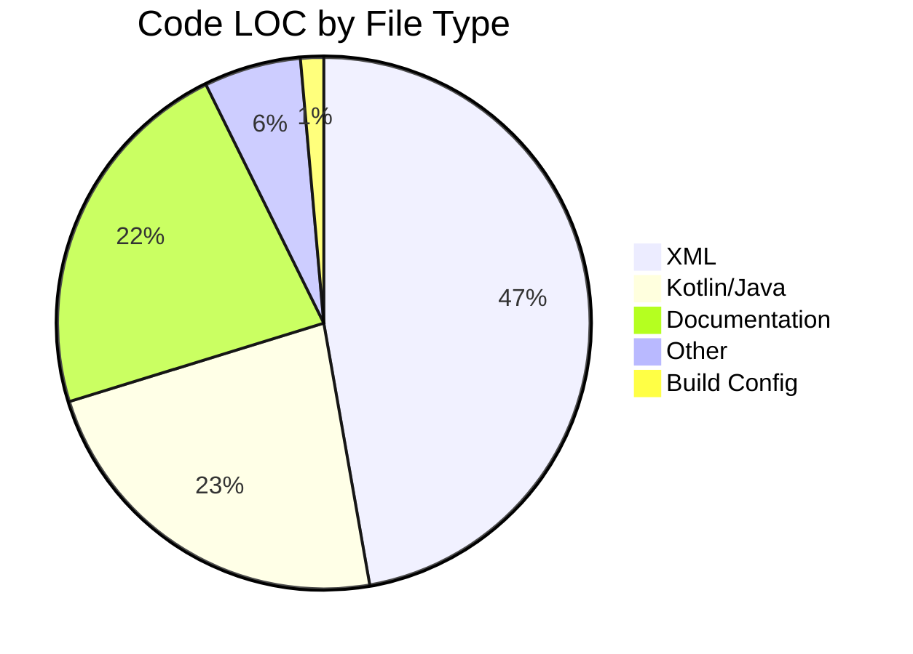
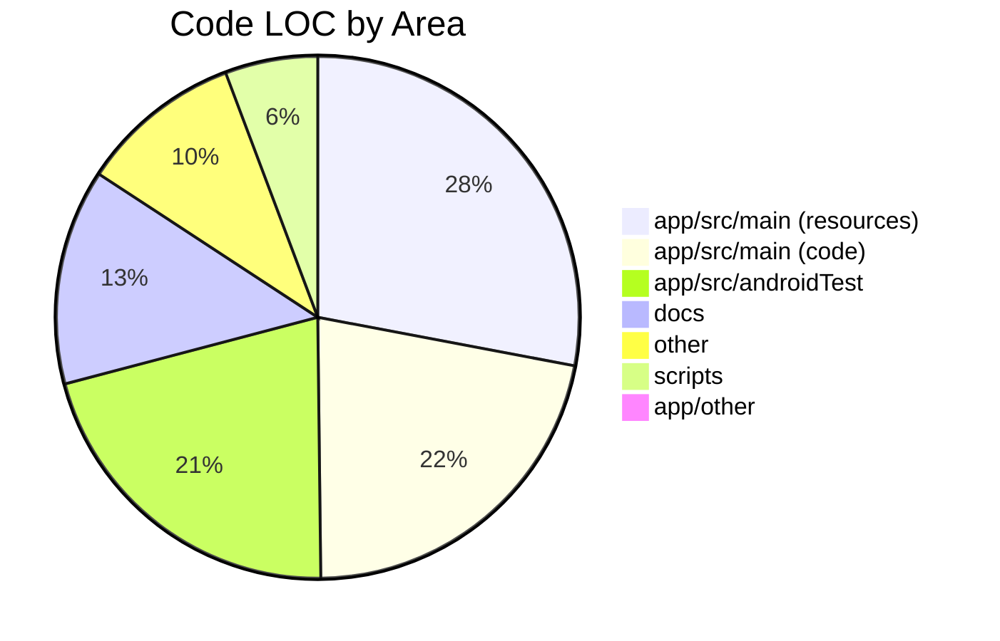

# Android Fourteeners 🏔️

[](https://www.gnu.org/licenses/gpl-3.0)
[](https://developer.android.com)
[](https://kotlinlang.org)
[](https://android-arsenal.com/api?level=21)
[](CONTRIBUTING.md)
[](CODE_OF_CONDUCT.md)

A modern Android application for tracking summit attempts on Colorado's fourteeners (peaks above 14,000 feet), written in Kotlin and targeting Android API 33.

## Features

- Summit register for tracking your fourteener climbs
- GPS-based nearby peak detection
- Photo proof upload capability
- Progress tracking (X/53 fourteeners completed)
- Leave No Trace principles information

## Technical Details

- **Language**: Kotlin (migrated from Java)
- **Target SDK**: Android API 33 (Android 13)
- **Minimum SDK**: Android API 21 (Android 5.0)
- **Build System**: Gradle 7.6 with Android Gradle Plugin 7.4.2
- **Architecture**: SQLite database for local storage, AndroidX libraries

## Building

1. Clone the repository
2. Open in Android Studio
3. Build and run

```bash
./gradlew build
```

## Migration Notes

This project has been modernized from the original Java codebase:
- Converted from Java to Kotlin
- Updated from Android API 19 to API 33
- Migrated from legacy support libraries to AndroidX
- Updated build tools and dependencies

## Contributing

We welcome contributions! Please see our [Contributing Guidelines](CONTRIBUTING.md) for details.

Also, please review our:
- [Code of Conduct](CODE_OF_CONDUCT.md) - Our mountaineering-themed community guidelines
- [Security Policy](SECURITY.md) - For reporting security vulnerabilities

Contribute what you can when you can and only if you *want* to! 🎿

## License

This project is licensed under the GNU General Public License v3.0 - see the [LICENSE](LICENSE) file for details.

## Acknowledgments

- Colorado's majestic fourteeners for the inspiration
- The hiking community for beta and trail conditions
- All contributors who help improve this app
- Coffee shops at altitude for providing WiFi and warmth

---

<!-- BEGIN: REPO-STATS -->

## Repository Statistics

### Overview
- **Total Files**: 68
- **Code Lines**: 4,636
- **Total Lines**: 5,715

### Code Distribution by File Type


| File Type | Files | Code LOC | Total Lines |
|-----------|-------|----------|-------------|
| XML | 36 | 2,190 | 2,447 |
| Kotlin/Java | 18 | 1,066 | 1,475 |
| Documentation | 6 | 1,042 | 1,335 |
| Other | 3 | 273 | 346 |
| Build Config | 5 | 65 | 112 |

### Code Distribution by Area


| Area | Files | Code LOC | Total Lines |
|------|-------|----------|-------------|
| app/src/main (resources) | 21 | 1,285 | 1,432 |
| app/src/main (code) | 17 | 1,003 | 1,400 |
| app/src/androidTest | 16 | 968 | 1,090 |
| docs | 2 | 613 | 737 |
| other | 9 | 461 | 665 |
| scripts | 1 | 263 | 336 |
| app/other | 2 | 43 | 55 |

### Kotlin/Java Modules
| Module | Files | Code LOC | Total Lines |
|--------|-------|----------|-------------|
| activities | 8 | 397 | 530 |
| utils | 5 | 352 | 517 |
| register | 3 | 247 | 316 |
| root | 1 | 7 | 37 |

_Generated by `make repo-stats`. LOC counts exclude blank lines and comments._

<!-- END: REPO-STATS -->
