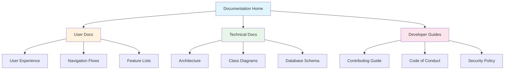
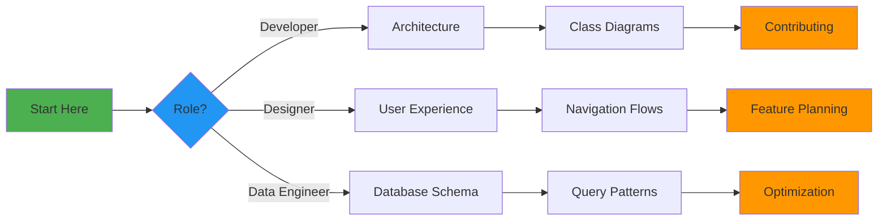

# Android Fourteeners Documentation

Welcome to the comprehensive documentation for the Android Fourteeners app. This documentation covers user experience, technical architecture, and implementation details.

## 📚 Documentation Index

### User Experience
- **[User Experience & Navigation](user-experience.md)** - Complete user journey, screen flows, and feature documentation
  - Navigation flow diagrams
  - Screen features and interactions
  - User journey scenarios
  - Accessibility features

### Technical Architecture
- **[System Architecture](architecture.md)** - High-level system design and component architecture
  - Layered architecture overview
  - Component interactions
  - Data flow patterns
  - Dependency management

- **[UML Class Diagrams](class-diagrams.md)** - Detailed class structures and relationships
  - Core classes overview
  - Data layer classes
  - Design patterns used
  - Class responsibilities

- **[Database Schema](database-schema.md)** - SQLite database design and operations
  - Table structures
  - Query patterns
  - Data relationships
  - Migration strategies

## 🗺️ Quick Navigation Guide



## 📊 Documentation Statistics

| Document | Diagrams | Tables | Lines |
|----------|----------|--------|-------|
| User Experience | 11 Mermaid | 0 | 300+ |
| Architecture | 13 Mermaid | 0 | 400+ |
| Class Diagrams | 12 Mermaid | 1 | 500+ |
| Database Schema | 10 Mermaid | 5 | 450+ |

## 🎯 Documentation Purpose

### For Users
- Understand app navigation and features
- Learn about each screen's functionality
- Discover accessibility features
- Review user journey scenarios

### For Developers
- Understand system architecture
- Review class structures and relationships
- Learn about database schema
- Follow established design patterns

### For Contributors
- Get familiar with codebase structure
- Understand architectural decisions
- Review coding standards
- Plan improvements and features

## 🔧 Using This Documentation

### Viewing Diagrams
All diagrams are created using Mermaid and can be viewed:
1. **In GitHub**: Diagrams render automatically in markdown files
2. **In VSCode**: Install the Mermaid preview extension
3. **In Other Editors**: Use a Mermaid live editor or converter

### Generating Diagram Images
To generate PNG images from the Mermaid diagrams:
```bash
# Install mermaid-cli
npm install -g @mermaid-js/mermaid-cli

# Generate diagrams (if Makefile target exists)
make diagrams
```

### Updating Documentation
When making changes to the codebase:
1. Update relevant documentation files
2. Add/modify Mermaid diagrams as needed
3. Run `make repo-stats` to update statistics
4. Submit documentation updates with code changes

## 📈 Key Metrics

### Codebase Overview
- **Languages**: Kotlin (primary), XML (resources)
- **Architecture**: Layered with Activities, Services, and Data layers
- **Database**: SQLite with helper classes
- **Patterns**: Singleton, Adapter, Observer, Repository

### App Capabilities
- **Mountains Tracked**: 53 official + 5 unofficial fourteeners
- **Data Points**: 14 fields per summit entry
- **Location Services**: GPS, Network, and Passive providers
- **Storage**: Local SQLite + Internal file storage for photos

## 🚀 Quick Start Guides

### For New Developers
1. Start with [System Architecture](architecture.md)
2. Review [UML Class Diagrams](class-diagrams.md)
3. Understand [Database Schema](database-schema.md)
4. Explore [User Experience](user-experience.md)

### For UI/UX Designers
1. Begin with [User Experience](user-experience.md)
2. Review navigation flows and screen features
3. Check accessibility features section
4. Understand current limitations and future improvements

### For Database Work
1. Start with [Database Schema](database-schema.md)
2. Review query patterns and operations
3. Understand data relationships
4. Check migration strategies

## 🔄 Documentation Maintenance

### Keeping Docs Current
- Documentation should be updated alongside code changes
- Diagrams should reflect current implementation
- Remove outdated information promptly
- Add new features to relevant sections

### Documentation Standards
- Use Mermaid for all diagrams
- Follow markdown best practices
- Include examples where helpful
- Keep technical accuracy as priority

## 📝 Related Documentation

### Project-Level Docs
- [Main README](../README.md) - Project overview and setup
- [Contributing Guidelines](../CONTRIBUTING.md) - How to contribute
- [Code of Conduct](../CODE_OF_CONDUCT.md) - Community standards
- [Security Policy](../SECURITY.md) - Security reporting

### External Resources
- [Android Developer Guide](https://developer.android.com/guide)
- [Kotlin Documentation](https://kotlinlang.org/docs/)
- [SQLite Documentation](https://www.sqlite.org/docs.html)
- [Material Design Guidelines](https://material.io/design)

## 🎓 Learning Path



## 🤝 Contributing to Docs

### Adding New Documentation
1. Create markdown file in `/docs`
2. Add Mermaid diagrams for visual elements
3. Update this README with links
4. Run `make repo-stats` if adding code

### Improving Existing Docs
1. Keep technical accuracy paramount
2. Add examples for complex concepts
3. Update diagrams to match code
4. Maintain consistent formatting

### Documentation Review Checklist
- [ ] Technical accuracy verified
- [ ] Diagrams render correctly
- [ ] Links work properly
- [ ] Formatting is consistent
- [ ] Examples are current
- [ ] No sensitive information exposed

## 📞 Contact & Support

For questions about the documentation:
1. Open an issue on GitHub
2. Tag with `documentation` label
3. Provide specific section references

## 🏔️ Happy Documentation Reading!

*"Good documentation is like a well-marked trail - it helps you reach the summit safely."*