# System Architecture Documentation

## High-Level Architecture

The Android Fourteeners app follows a layered architecture pattern with clear separation of concerns:

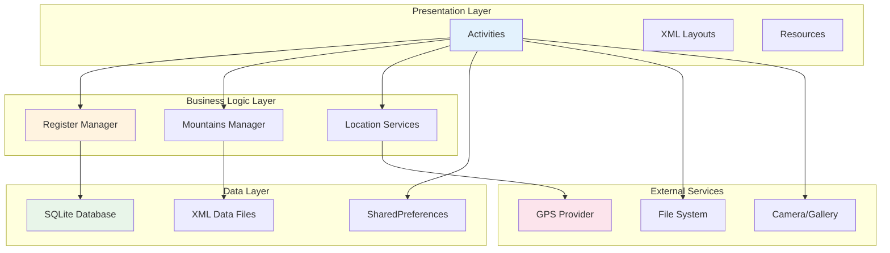

## Component Architecture

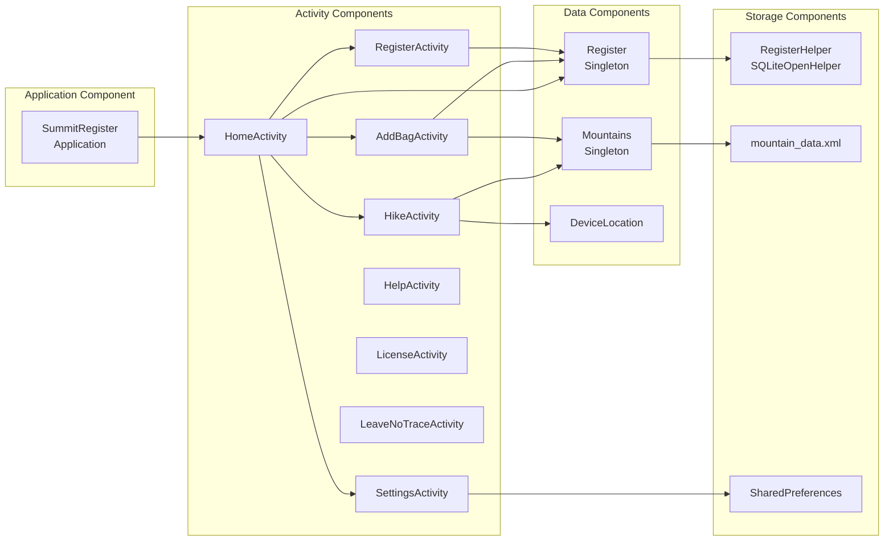

## Data Flow Architecture

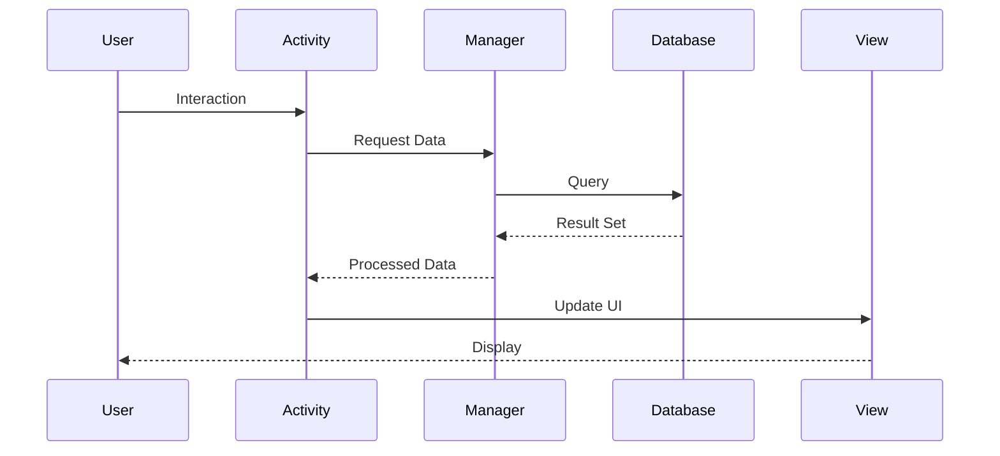

## Singleton Pattern Implementation

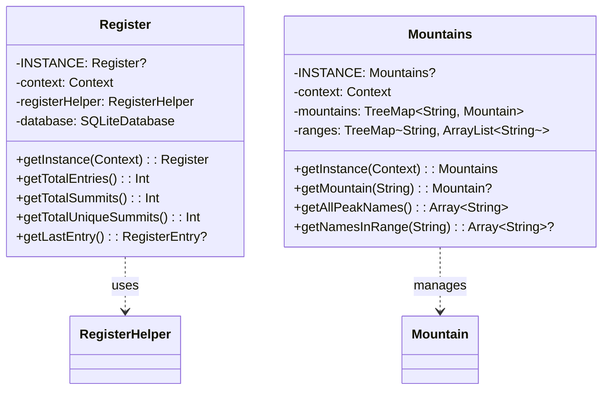

## Location Service Architecture

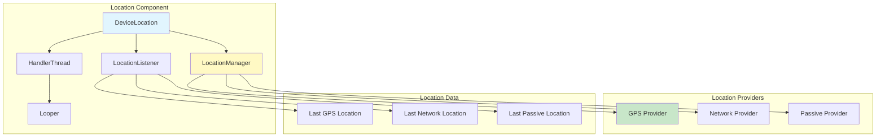

## Activity Lifecycle Management

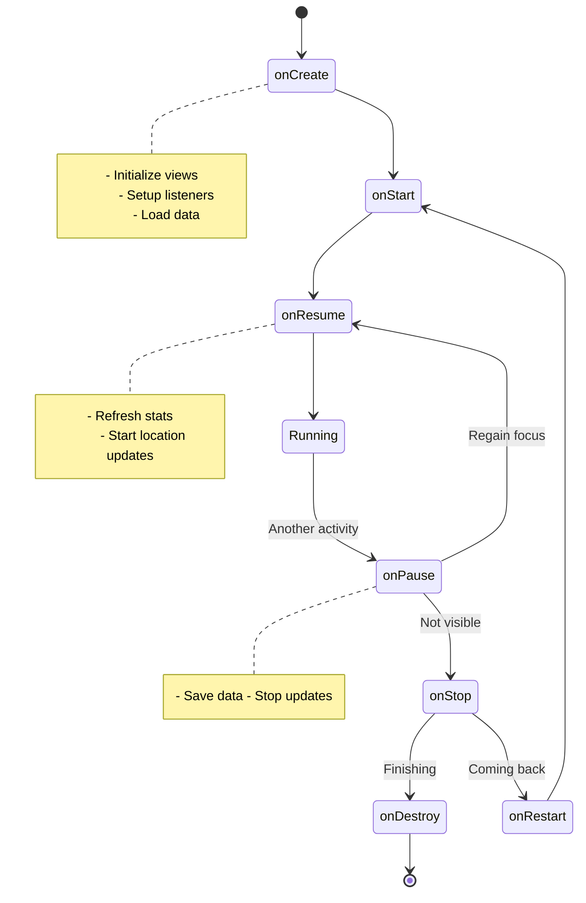

## Dependency Graph

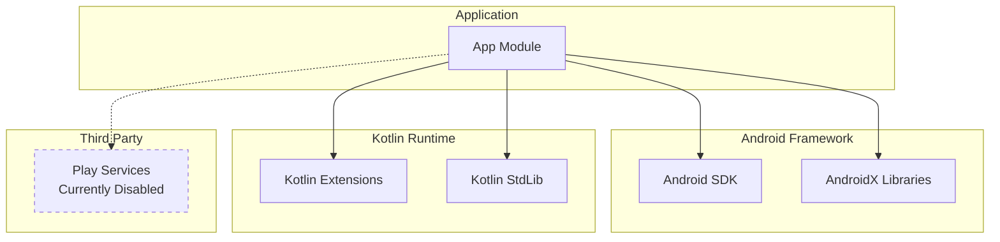

## Build Architecture

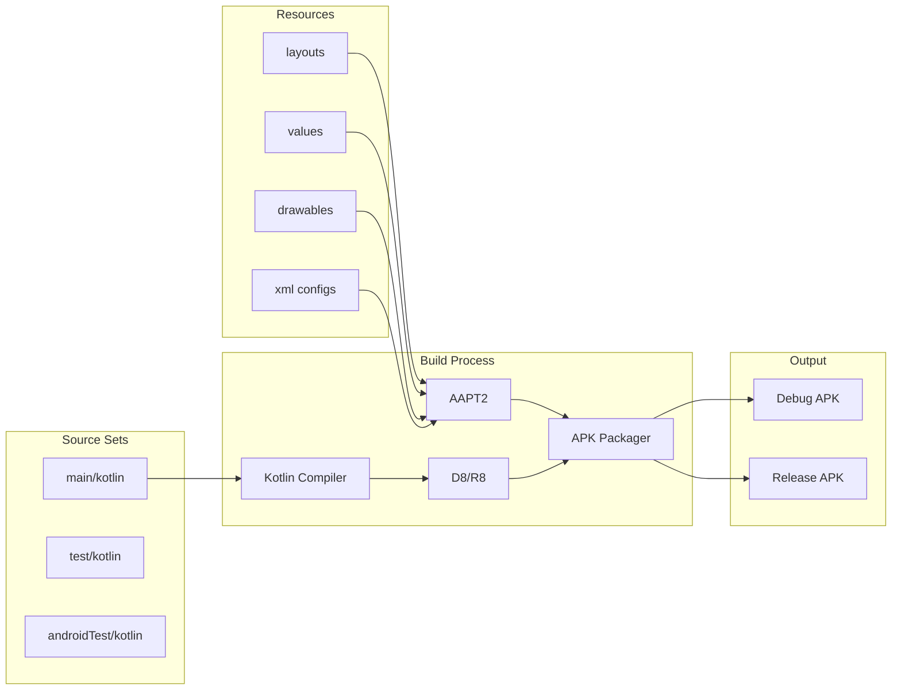

## Module Structure

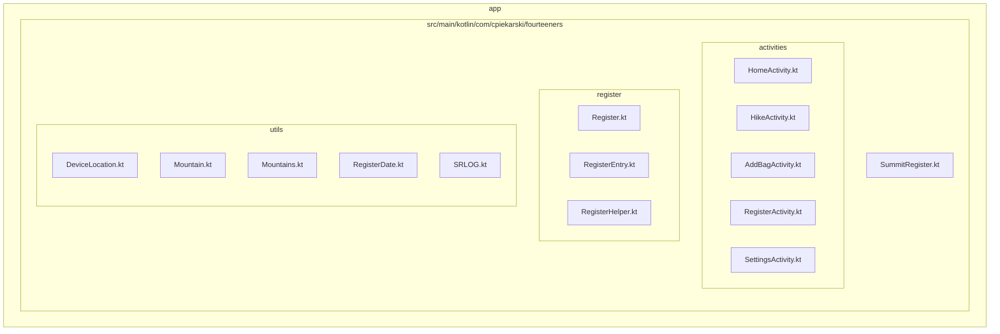

## Security Architecture

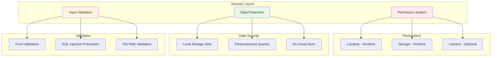

## Performance Considerations

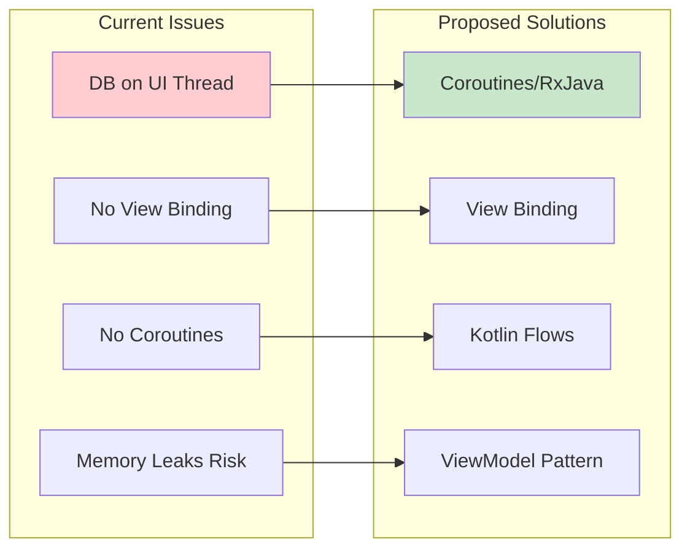

## Future Architecture Improvements

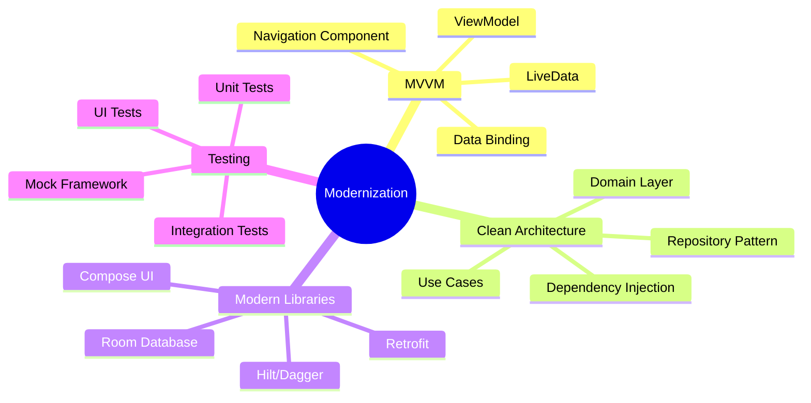

## Current Technical Debt

1. **Database Operations on UI Thread**: Risk of ANR
2. **Context in Singletons**: Potential memory leaks
3. **No Dependency Injection**: Tight coupling
4. **Manual View Management**: Boilerplate code
5. **No Architecture Pattern**: Mixed responsibilities
6. **Limited Test Coverage**: Only one test file
7. **Hardcoded Strings**: Some UI strings in code
8. **No Error Recovery**: Limited error handling

## Recommended Architecture Evolution

### Phase 1: MVVM Migration
- Implement ViewModels for each Activity
- Use LiveData for reactive UI
- Extract business logic from Activities

### Phase 2: Repository Pattern
- Create repository layer
- Abstract data sources
- Implement caching strategy

### Phase 3: Dependency Injection
- Add Hilt for DI
- Remove singletons
- Improve testability

### Phase 4: Modern UI
- Migrate to Compose
- Implement Material Design 3
- Add animations and transitions