# UML Class Diagrams

## Core Classes Overview

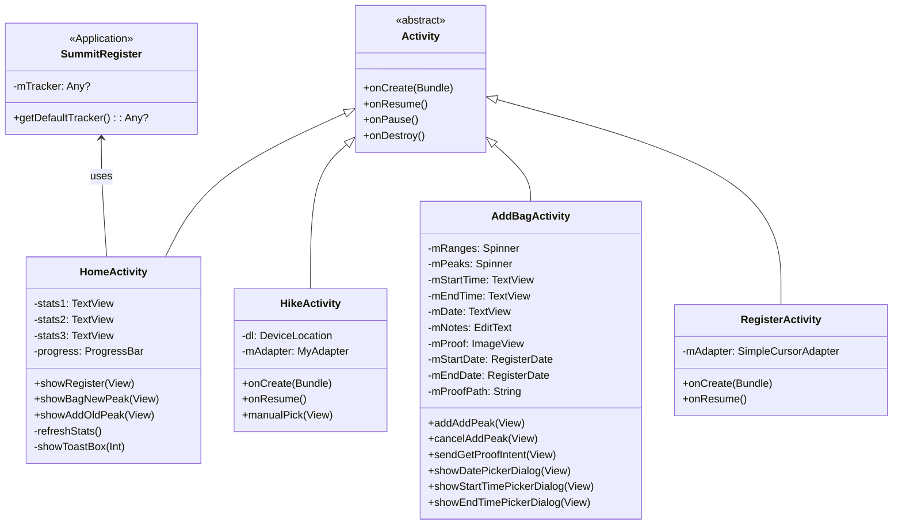

## Data Layer Classes

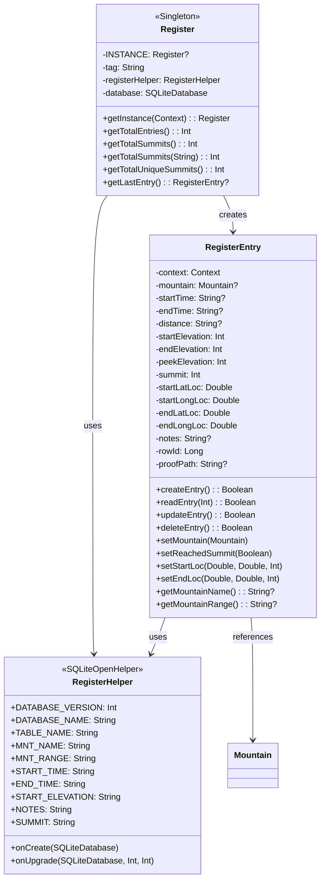

## Mountain Data Classes

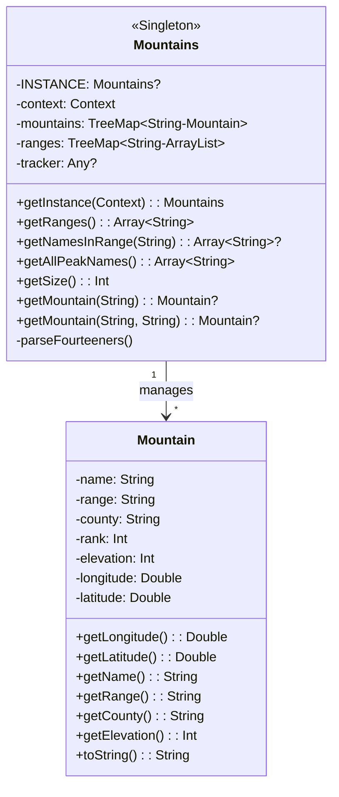

## Location Services Classes

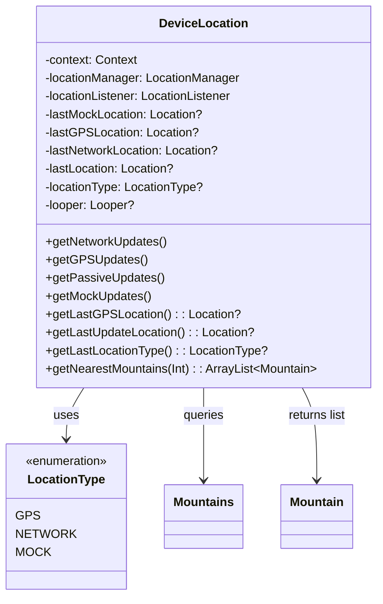

## Utility Classes

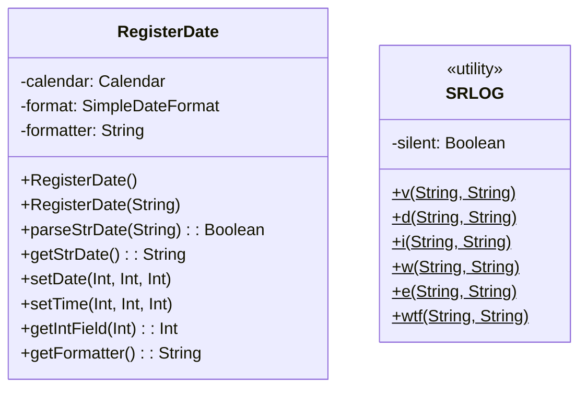

## Activity Relationships

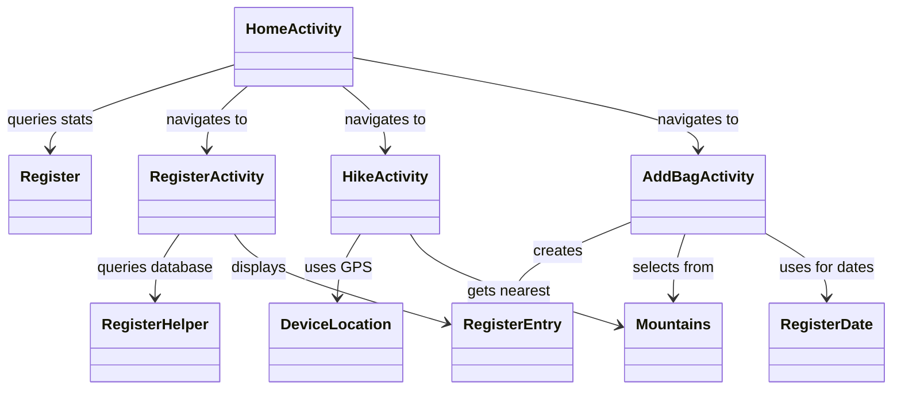

## Database Schema Classes

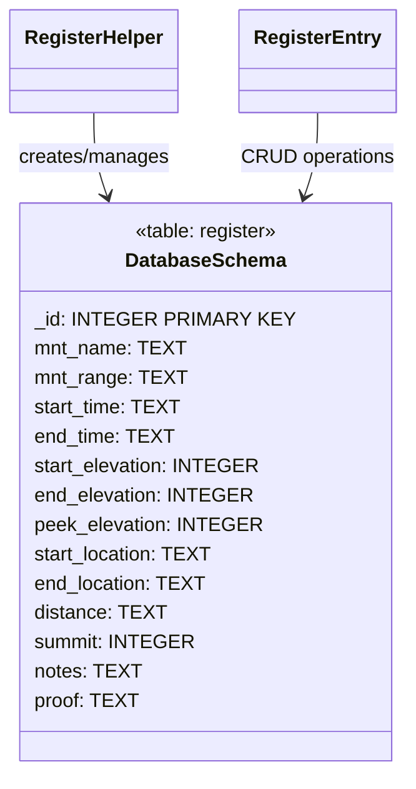

## Adapter Pattern

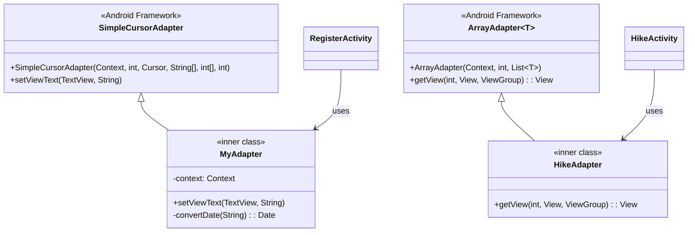

## Singleton Pattern Implementation

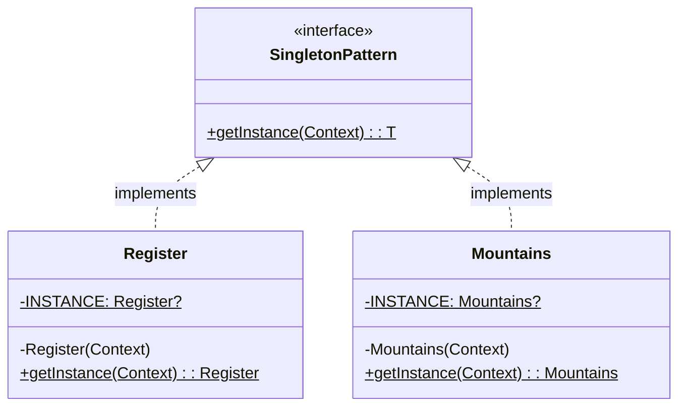

## Settings Architecture

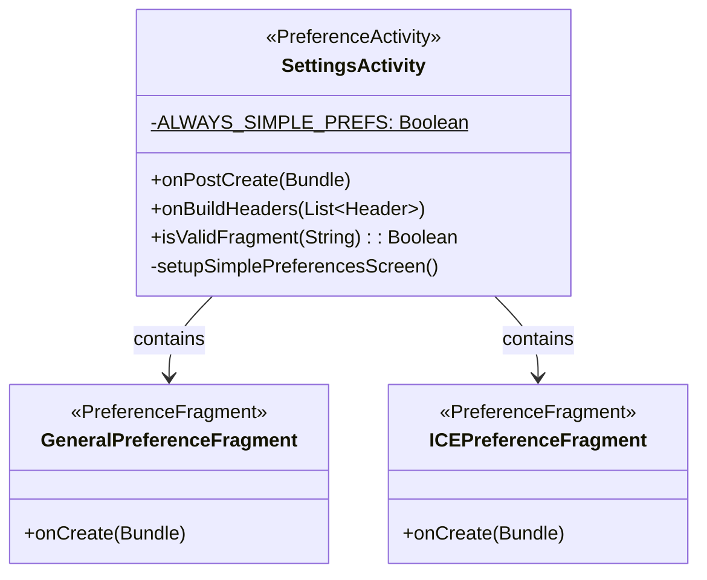

## Exception and Error Handling

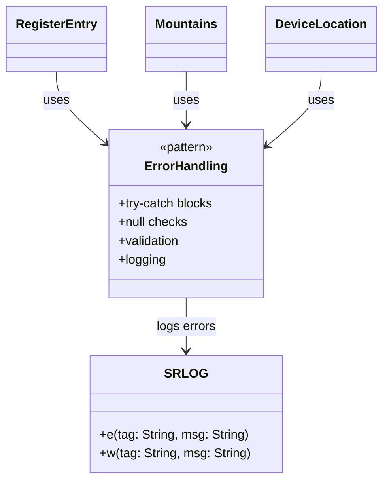

## Design Patterns Used

1. **Singleton Pattern**: Register, Mountains classes
2. **Adapter Pattern**: Custom adapters for ListView
3. **Observer Pattern**: LocationListener for GPS updates
4. **Template Method**: Activity lifecycle methods
5. **Factory Pattern**: RegisterEntry creation
6. **Repository Pattern**: Register class for data access
7. **Builder Pattern**: Implicit in Android Views and Dialogs

## Class Responsibilities

| Class | Primary Responsibility | Design Pattern |
|-------|----------------------|----------------|
| SummitRegister | Application-wide state | Application class |
| Register | Data access layer | Singleton, Repository |
| RegisterEntry | Data model | Entity, CRUD |
| RegisterHelper | Database management | SQLiteOpenHelper |
| Mountains | Mountain data provider | Singleton |
| Mountain | Data model | Value object |
| DeviceLocation | Location services | Service, Observer |
| RegisterDate | Date formatting | Utility |
| SRLOG | Logging | Utility, Facade |
| Activities | UI Controllers | MVC Controller |