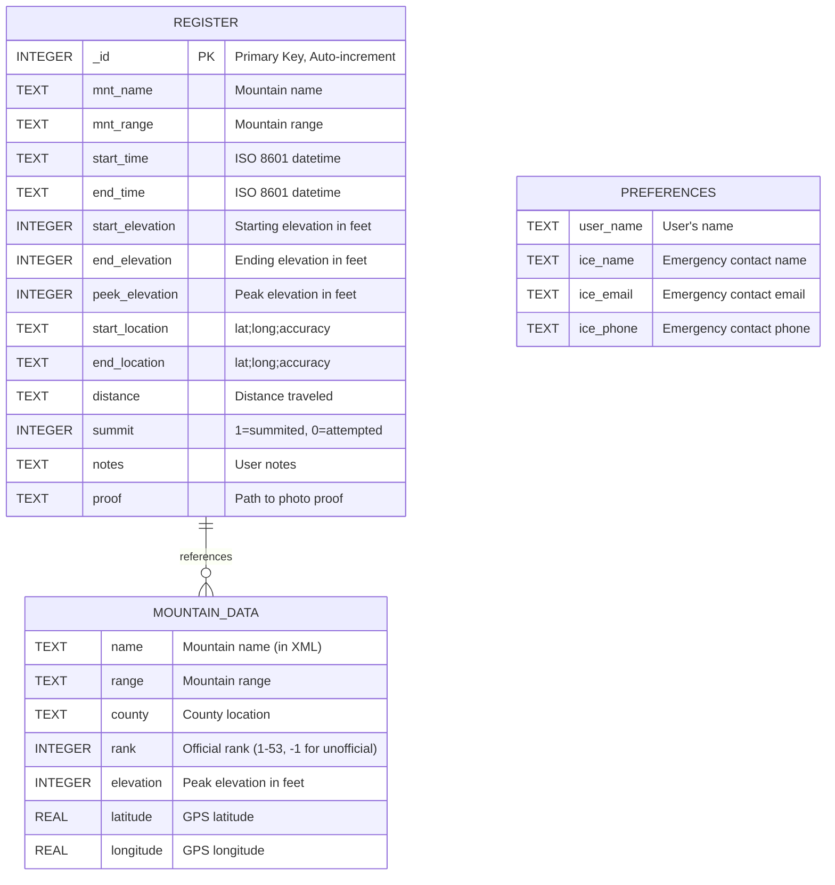
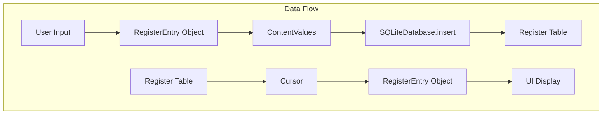
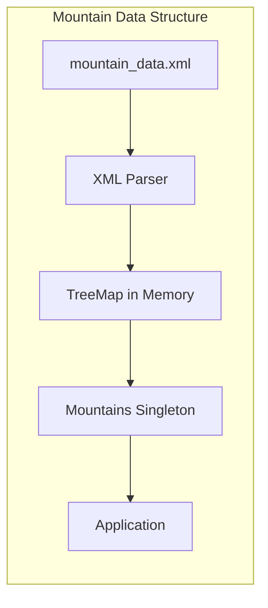
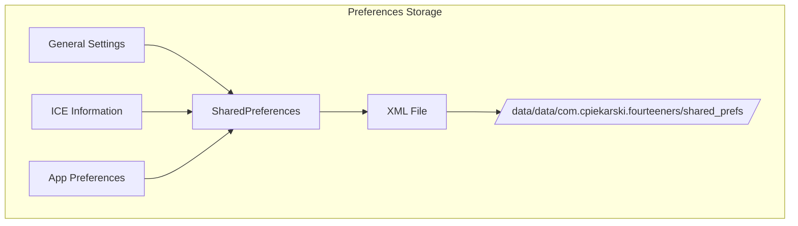
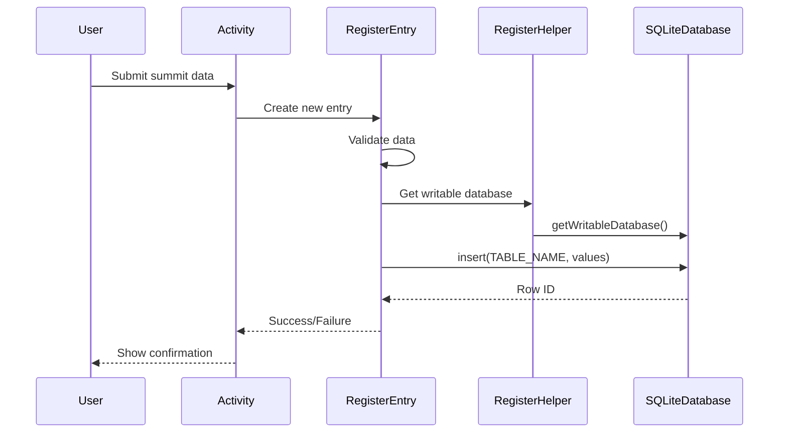
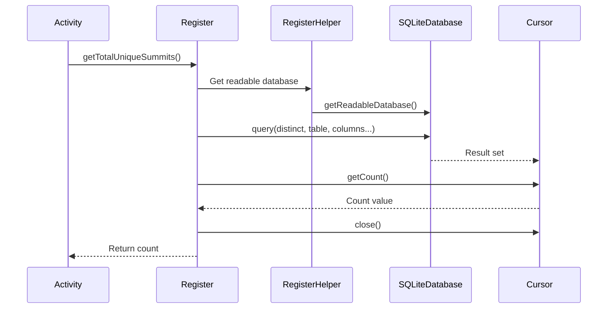
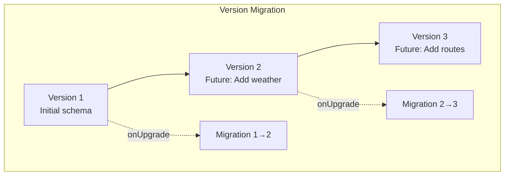
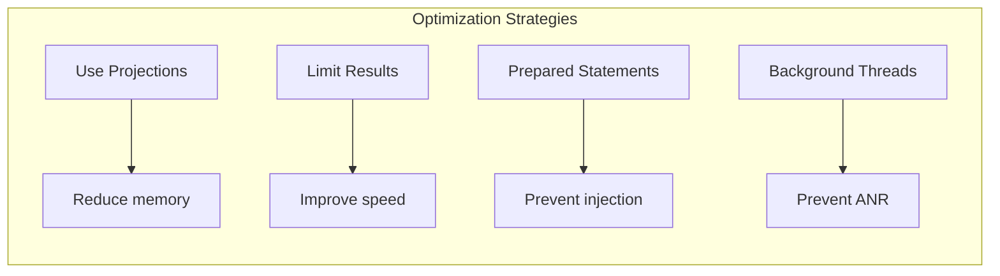
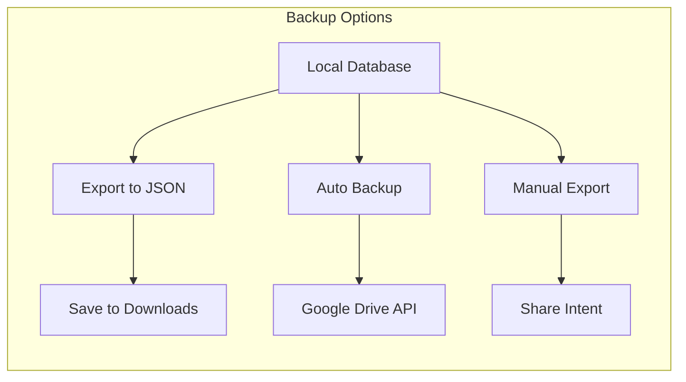

# Database Schema Documentation

## Overview

The Android Fourteeners app uses SQLite for local data persistence. The database stores summit attempts, user achievements, and climbing history.

## Database Structure



## Table Details

### Register Table

The main table storing all summit attempts and completions.

```mermaid
graph LR
    subgraph "Register Table Schema"
        A[_id: INTEGER PRIMARY KEY AUTOINCREMENT]
        B[mnt_name: TEXT]
        C[mnt_range: TEXT]
        D[start_time: TEXT]
        E[end_time: TEXT]
        F[start_elevation: INTEGER]
        G[end_elevation: INTEGER]
        H[peek_elevation: INTEGER]
        I[start_location: TEXT]
        J[end_location: TEXT]
        K[distance: TEXT]
        L[summit: INTEGER]
        M[notes: TEXT]
        N[proof: TEXT]
    end
```



#### Field Specifications

| Field | Type | Constraints | Description | Example |
|-------|------|------------|-------------|---------|
| _id | INTEGER | PRIMARY KEY, AUTOINCREMENT | Unique entry identifier | 1, 2, 3... |
| mnt_name | TEXT | NOT NULL | Mountain name | "Longs Peak" |
| mnt_range | TEXT | NOT NULL | Mountain range | "Front" |
| start_time | TEXT | | ISO 8601 datetime | "2024-07-15T06:30:00-0600" |
| end_time | TEXT | | ISO 8601 datetime | "2024-07-15T14:45:00-0600" |
| start_elevation | INTEGER | | Starting elevation (feet) | 9400 |
| end_elevation | INTEGER | | Ending elevation (feet) | 9400 |
| peek_elevation | INTEGER | | Peak elevation (feet) | 14255 |
| start_location | TEXT | | Semicolon-delimited location | "40.2718;-105.5568;10" |
| end_location | TEXT | | Semicolon-delimited location | "40.2718;-105.5568;15" |
| distance | TEXT | | Total distance | "14.5 miles" |
| summit | INTEGER | DEFAULT 0 | Success flag (0/1) | 1 |
| notes | TEXT | | User notes | "Beautiful weather!" |
| proof | TEXT | | Photo file path | "/data/proof/summit_123.jpg" |

### Location Format

Locations are stored as semicolon-delimited strings:
```
latitude;longitude;accuracy
```

Example: `"40.254902;-105.615738;10"`

## Data Relationships



## Queries

### Common Query Patterns

#### 1. Get Total Unique Summits
```sql
SELECT DISTINCT mnt_name
FROM register
WHERE summit = 1;
```

#### 2. Get Last Summit Entry
```sql
SELECT * FROM register
WHERE summit = 1
ORDER BY _id DESC
LIMIT 1;
```

#### 3. Get Summit History
```sql
SELECT * FROM register
ORDER BY start_time ASC;
```

#### 4. Get Mountain Statistics
```sql
SELECT mnt_name,
       COUNT(*) as attempts,
       SUM(summit) as summits
FROM register
GROUP BY mnt_name;
```

## Mountain Data (XML Resource)

Mountain data is stored in XML resources, not in the database:



### Mountain XML Schema
```xml
<mountain
    name="String"
    range="String"
    county="String"
    rank="Integer"
    elevation="Integer"
    lat="Double"
    long="Double" />
```

## SharedPreferences Storage

User preferences and settings stored separately:



## Database Operations

### Create Operation Flow



### Read Operation Flow



## Data Migration Strategy



### Future Schema Additions (Proposed)

```sql
-- Version 2: Add weather tracking
ALTER TABLE register ADD COLUMN weather_conditions TEXT;
ALTER TABLE register ADD COLUMN temperature INTEGER;

-- Version 3: Add route information
ALTER TABLE register ADD COLUMN route_name TEXT;
ALTER TABLE register ADD COLUMN difficulty TEXT;

-- Version 4: Add social features
CREATE TABLE friends (
    _id INTEGER PRIMARY KEY AUTOINCREMENT,
    friend_name TEXT,
    friend_id TEXT
);

CREATE TABLE shared_summits (
    _id INTEGER PRIMARY KEY AUTOINCREMENT,
    register_id INTEGER,
    friend_id INTEGER,
    FOREIGN KEY(register_id) REFERENCES register(_id)
);
```

## Performance Considerations

### Indexes
Currently no custom indexes defined. Consider adding:

```sql
CREATE INDEX idx_summit ON register(summit);
CREATE INDEX idx_mountain ON register(mnt_name);
CREATE INDEX idx_date ON register(start_time);
```

### Query Optimization



## Data Integrity

### Constraints and Validation

```mermaid
graph TD
    subgraph "Data Validation Layers"
        UI[UI Validation] --> Model[Model Validation]
        Model --> DB[Database Constraints]

        UI --> U1[Date pickers]
        UI --> U2[Spinners for selection]

        Model --> M1[RegisterEntry.validate()]
        Model --> M2[Mountain exists check]

        DB --> D1[Column types]
        DB --> D2[NOT NULL constraints]
    end
```

## Backup and Recovery

### Current State
- Local storage only
- No cloud backup
- Manual export possible via file system

### Proposed Backup Strategy



## Security Considerations

1. **No Encryption**: Database is not encrypted
2. **Local Only**: No network transmission of data
3. **Parameterized Queries**: Protection against SQL injection
4. **File Permissions**: Standard Android app sandbox protection
5. **Photo Storage**: Internal app directory for summit photos

## Database Size Estimation

| Data Type | Avg Size | Records/Year | Annual Size |
|-----------|----------|--------------|-------------|
| Summit Entry | ~500 bytes | ~100 | ~50 KB |
| Photos | ~2 MB each | ~100 | ~200 MB |
| Total Annual | - | - | ~200 MB |

## Maintenance Operations

```sql
-- Vacuum database to reclaim space
VACUUM;

-- Analyze for query optimization
ANALYZE;

-- Check integrity
PRAGMA integrity_check;

-- Get database info
PRAGMA database_list;
PRAGMA table_info(register);
```