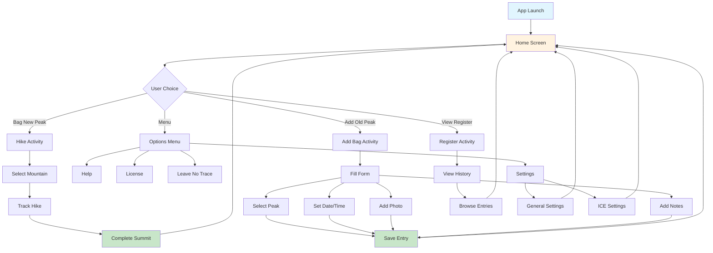
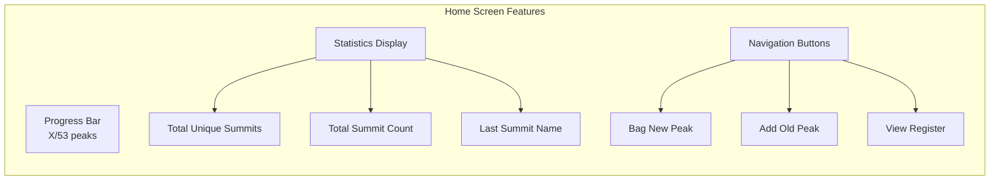
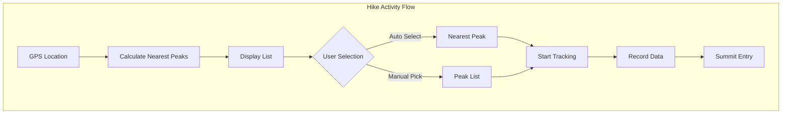
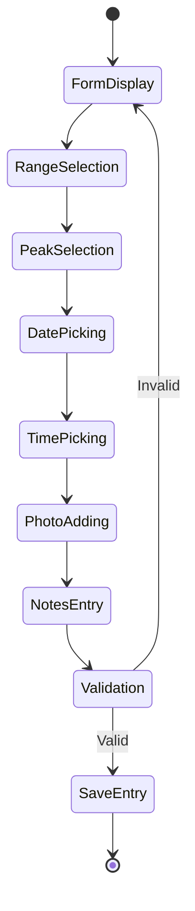
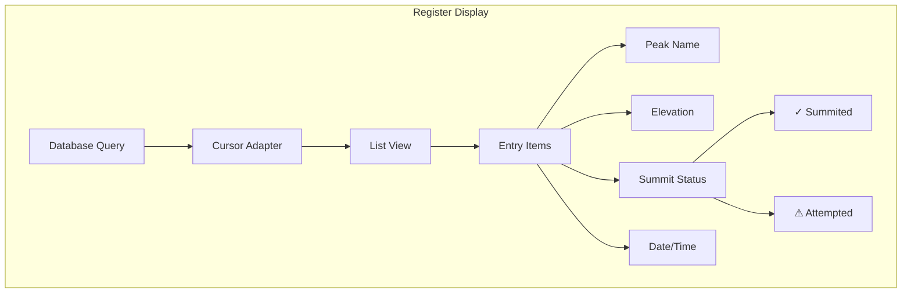
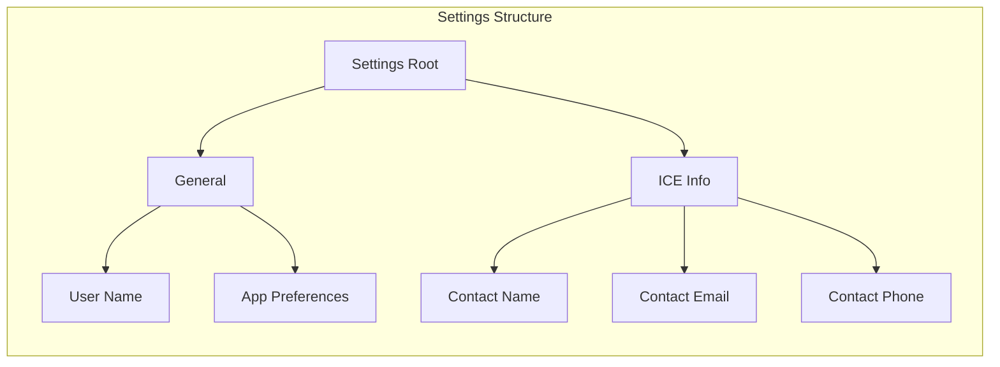
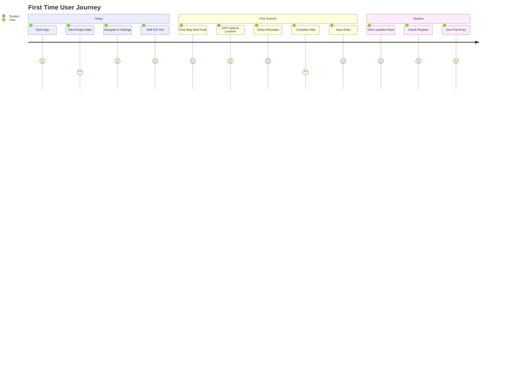
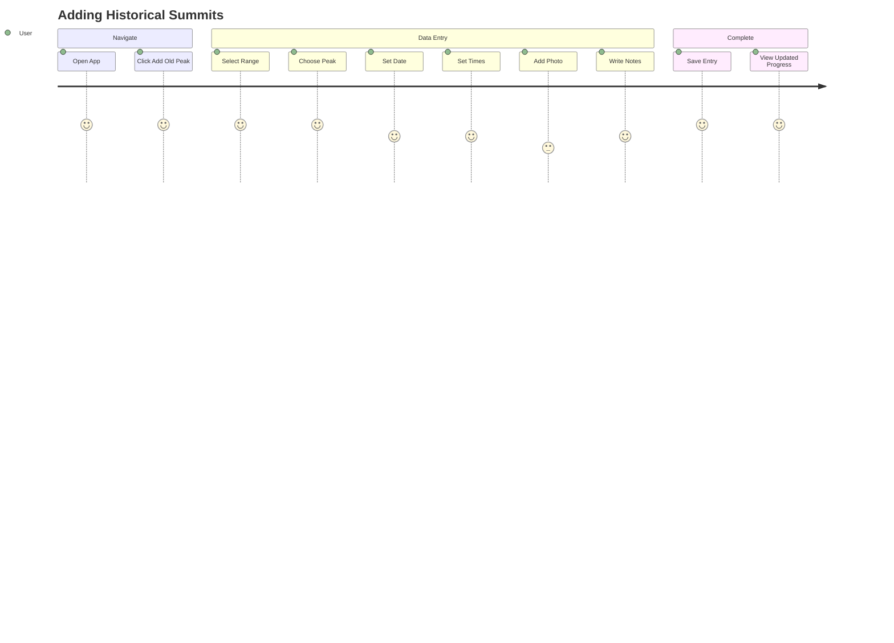
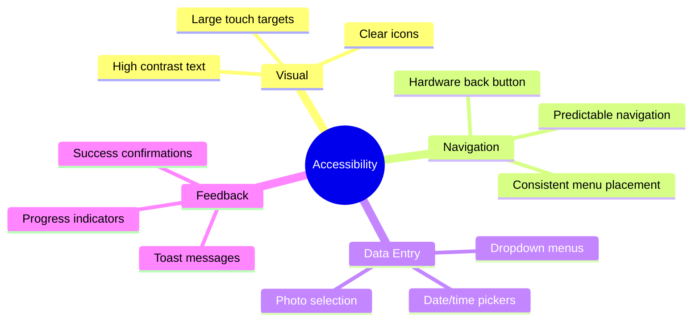
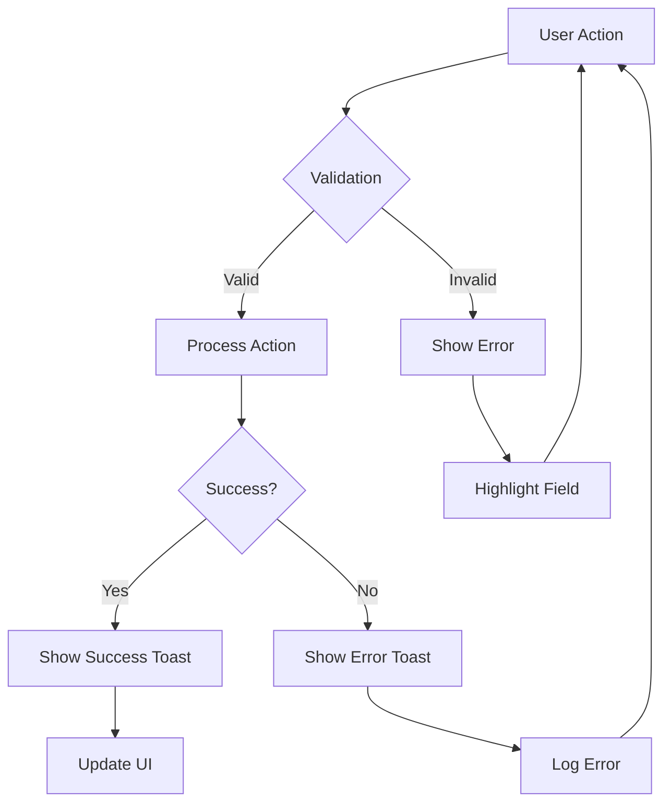

# User Experience Documentation

## Navigation Flow

The following diagram shows the screen navigation flow and user journey through the Android Fourteeners app:

## Screen Features

### 1. Home Screen (HomeActivity)
Main dashboard displaying user progress and navigation options.

**Key Features:**
- Visual progress tracking (0-53 fourteeners)
- Quick stats at a glance
- Three main action buttons
- Options menu access

### 2. Hike Activity
For tracking a current hike with GPS assistance.

**Key Features:**
- GPS-based nearest mountain detection
- Shows 10 nearest fourteeners
- Manual peak selection option
- Real-time location tracking

### 3. Add Bag Activity
For manually adding past summit attempts.

**Key Features:**
- Mountain range filtering
- Peak selection from dropdown
- Date and time pickers
- Photo proof upload
- Notes field for details
- Form validation

### 4. Register Activity
Summit history viewer with chronological entries.

**Key Features:**
- Chronologically sorted entries
- Summit vs attempt distinction
- Formatted date display
- Mountain details per entry

### 5. Settings Activity
User preferences and emergency contact configuration.

**Key Features:**
- Two-pane layout on tablets
- General preferences
- In Case of Emergency (ICE) contact info
- Preference persistence

## User Journey Scenarios

### Scenario 1: First Time User

### Scenario 2: Experienced User Adding Past Summits

## Accessibility Features

## Error Handling

## Performance Considerations

- **GPS Updates**: Passive provider to conserve battery
- **Database Operations**: Read operations on UI thread (to be improved)
- **Image Handling**: Bitmap sampling to prevent OOM errors
- **List Views**: ViewHolder pattern for smooth scrolling
- **Location Services**: HandlerThread for background location updates

## Future UX Improvements

1. **Modern Navigation**: Bottom navigation or navigation drawer
2. **Material Design**: Update to Material 3 components
3. **Dark Mode**: System-wide dark theme support
4. **Offline Maps**: Trail maps for offline use
5. **Social Features**: Share summits, compare with friends
6. **Achievements**: Gamification elements
7. **Weather Integration**: Current conditions at peaks
8. **Trail Conditions**: Community-sourced updates